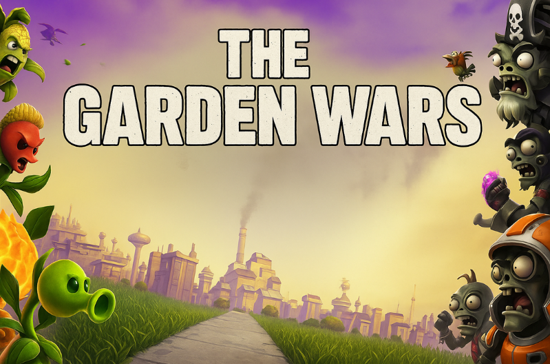
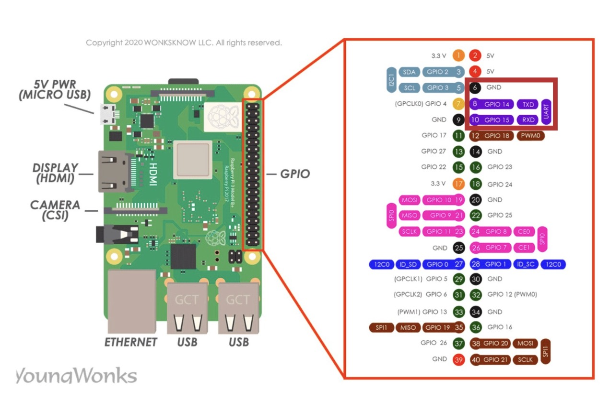
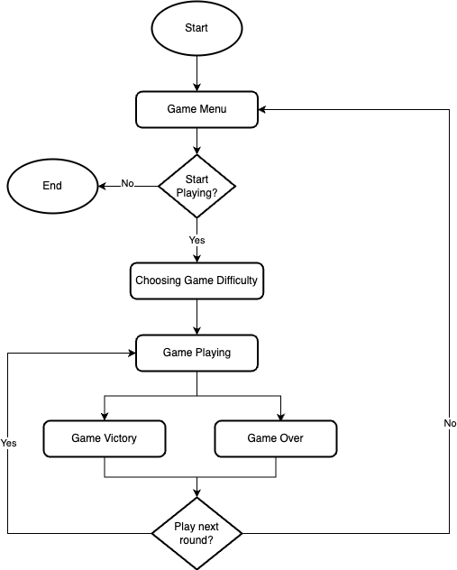
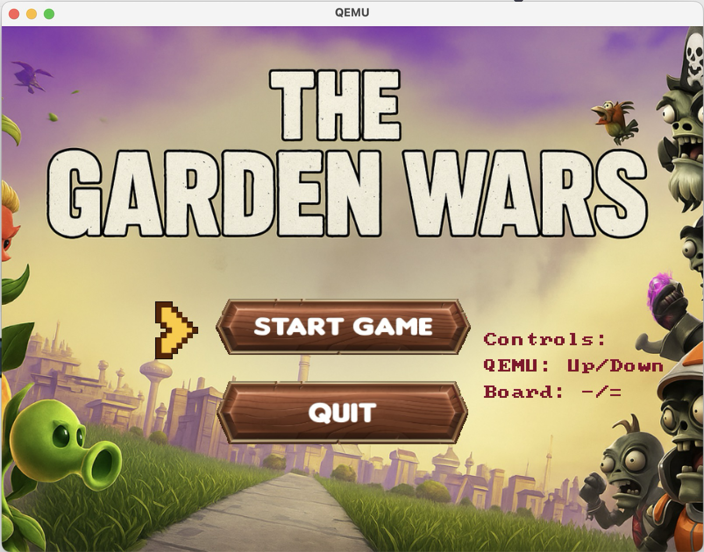
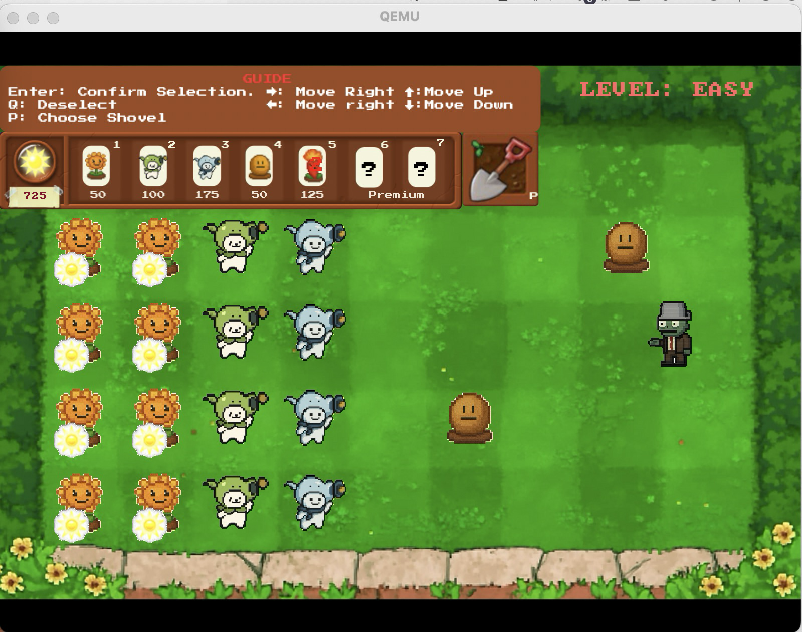
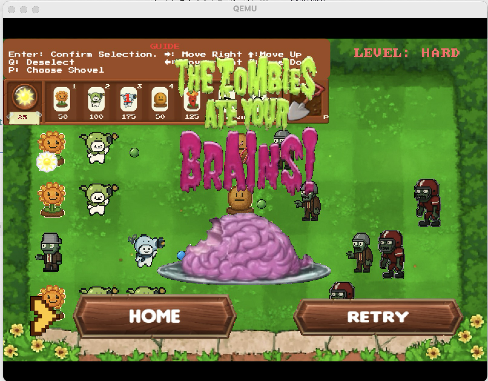
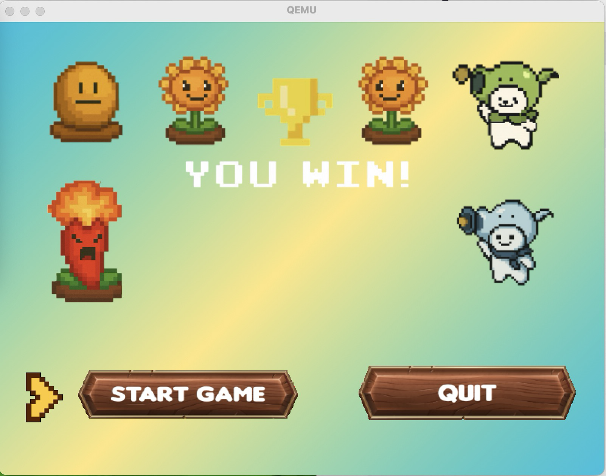
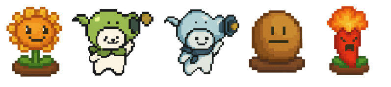
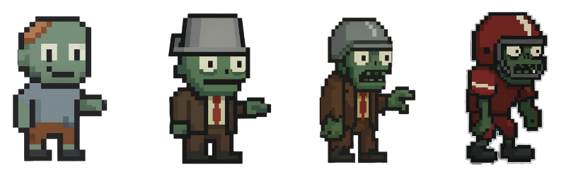

# ⚙️ PlantOS + The Garden Wars


**PlantOS** is a lightweight bare-metal operating system built from scratch for the Raspberry Pi, featuring a custom CLI, multimedia capabilities, and full hardware interfacing. On top of this OS, we developed **The Garden Wars**, an arcade-style tower defense game inspired by *Plants vs. Zombies*, running natively without any external libraries or OS dependencies.

This project was completed as part of the EEET2490 Embedded Systems course and demonstrates end-to-end system design — from kernel development to user interaction through real-time gameplay.

> 🧩 100% bare-metal C code  
> 🎮 Designed for real hardware and QEMU  
> 🌿 From bootloader to bullets — all in our control

📄 Licensed under the [MIT License](LICENSE)



## 📦 Project Structure

```md
The Garden Wars/
├── assets/                    # All visual and assets used in the game
│   ├── backgrounds/           # Background images for gameplay scenes and menus
│   ├── button/                # UI elements such as play, retry, and home buttons
│   ├── fonts/                 # Bitmap, array-based fonts used for rendering text
│   ├── selection/             # Assets for plant selection cards or interface
│   └── sprites/               # Main game sprites: zombies, plants, bullets
├── build/                     # Compilation outputs: object files, .img file, etc.
├── include/                   # Header (.h) files for declarations
├── src/                       # All source (.c) code implementing game and OS logic
│   ├── arch/                  # Architecture-specific code (e.g., boot.S, link.ld)
│   ├── cmd/                   # Implementation of command-line interface (CLI) features
│   ├── drivers/               # Peripheral drivers (UART, framebuffer, GPIO, etc.)
│   ├── games/                 # Core game logic: plants, zombies, plant grid
│   ├── video/                 # Video rendering logic (e.g., image, video displaying)
│   ├── kernel.c               # Main entry point and game state machine
│   └── utils.c                # Helper functions (e.g., string converter, maths)
├── Makefile                   # Build automation script defining how to compile/link
└── README.md                  # Project description, setup guide, and usage instruction
└── LICENSE                    # MIT License
```

## 🚀 Features

### 🖥️ PlantOS – Bare Metal Operating System

- **Welcome Screen** with custom ASCII art

- **Command-Line Interface (CLI)** with:

  - Auto-completion using `TAB`

  - Command history using `↑` (up) and `↓` (down)

  - Deletion/editing support with a preserved OS prompt

- **Core Commands:**
  - `help`, `clear`, `showinfo`, `baudrate`, `handshake`

### **📽️ Multimedia Output**

- Text rendering with custom fonts

- Image display over framebuffer

- Video playback using extracted RGB frames

- Team member names rendered over backgrounds

### 🎮 The Garden Wars Game

- Game inspired by Plants vs. Zombies

- Fixed and scalable grid for planting defense units

- Zombies attack in waves, increasing difficulty over time

- Game states: MENU → DIFFICULTY SELECT → PLAYING → GAME OVER / VICTORY

- CLI-GUI communication with ACK/NAK feedback

## 🔧 How to Build and Run

### ✅ Prerequisites

- Raspberry Pi 3/4 (bare-metal setup)

- GCC ARM cross-compiler (aarch64-linux-gnu-gcc)

- QEMU (for emulation testing)

### 🛠️ Build & Run Options

You can build specific parts of the project depending on your goal:

```bash
make           # Build everything (default)
make cli       # Build only the Command Line Interface (CLI)
make video     # Build only the video display demo
make game      # Build only The Garden Wars game
```

After building, flash the `kernel.img` in the `build/directory` to your SD card or run with QEMU:

## 🎮 How to Play

1. Launch the OS.

2. From CLI, type start game or select through GUI.

3. Choose difficulty level.

4. Use the keyboard to select and plant defenses.

5. Survive all waves of zombies to win.

## 🧠 Lessons Learned

- This project taught us:

- How to interface hardware using low-level C

- How to build framebuffer-based GUIs

- How to create a real-time game engine on bare metal

- Collaboration in version control and source management

### 📡 UART Communication Setup

To interact with the OS via CLI, connect your Raspberry Pi's UART pins to your host PC using a USB-to-TTL serial adapter. Refer to the pin mapping below:

- **TXD (GPIO 14, Pin 8)** → Connect to RXD on USB-Serial adapter  
- **RXD (GPIO 15, Pin 10)** → Connect to TXD on USB-Serial adapter  
- **GND (Pin 6)** → Connect to GND on USB-Serial adapter  



**Serial Configuration:**

- Baudrate: `115200`
- Data Bits: `8`
- Parity: `None`
- Stop Bits: `1`
- Flow Control: `None`

Use any serial monitor (e.g., `minicom`, `PuTTY`, or `screen`) to communicate with the CLI once the OS boots.

## 🛠️ Tools Used

We utilized a variety of tools to support development, media processing, and system building:

- [GNU Make](https://www.gnu.org/software/make/manual/make.html) – for build automation  
- [image2cpp](https://javl.github.io/image2cpp/) – to convert images into C-style RGB framebuffer  
- [Frame Extractor](https://frame-extractor.com/) – to extract individual frames from video clips  

> 🧠 With PlantOS and The Garden Wars, we transformed an academic assignment into a hands-on, end-to-end system software experience.

## 🧠 Game State Flow Chart



## 📷 Screenshots

|  |  |
|:--------------------------------------:|:------------------------------------:|
|       |  |
|   |                                     |
|  |  |

## 🎥 Demo Video

Watch the full demo of **PlantOS + The Garden Wars** in action:

[](https://youtu.be/r9GJwLXUIRY)

## 👥 Contributors

- Ngo Van Tai ([Github](https://github.com/TaiVanNgo))
- Huynh Thai Duong ([Github](https://github.com/TDuong04))
- Nguyen Pham Anh Thu ([Github](https://github.com/thu-ngx))
- Huynh Tan Phat ([Github](https://github.com/phatgg221))
